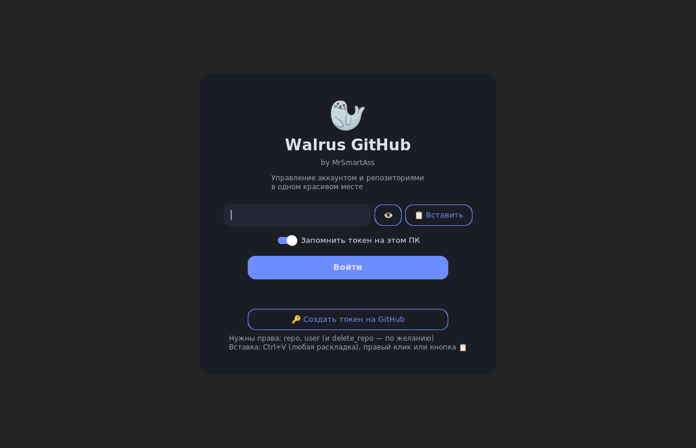
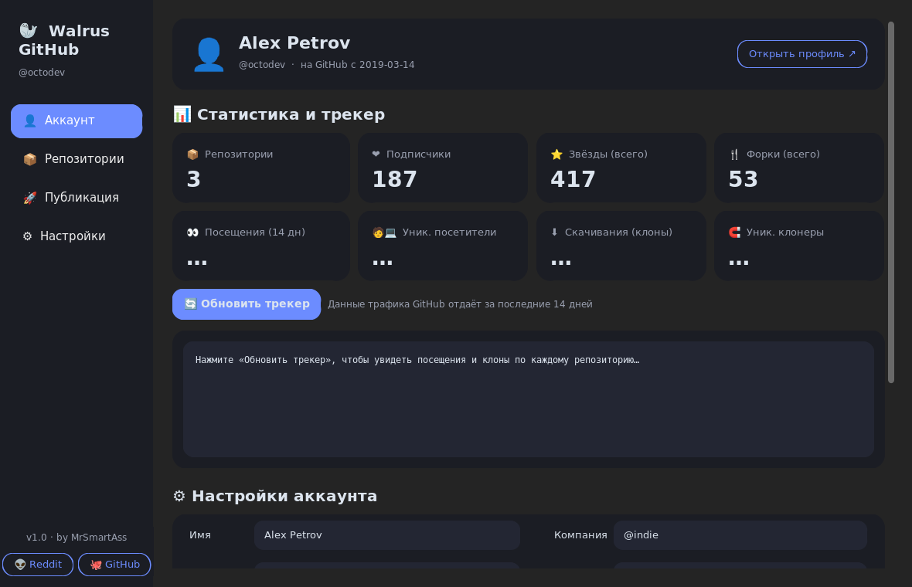
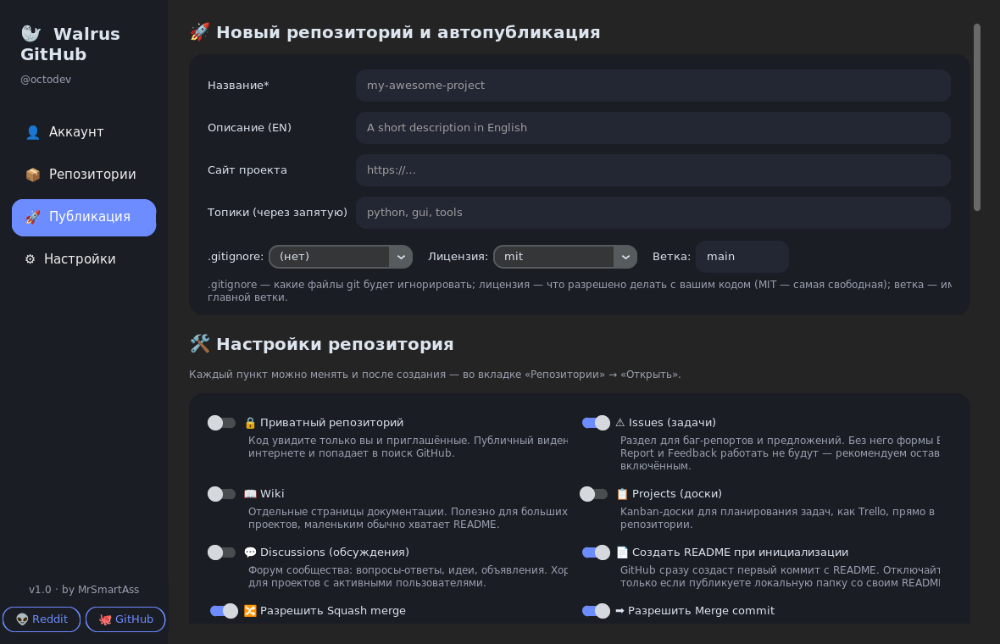
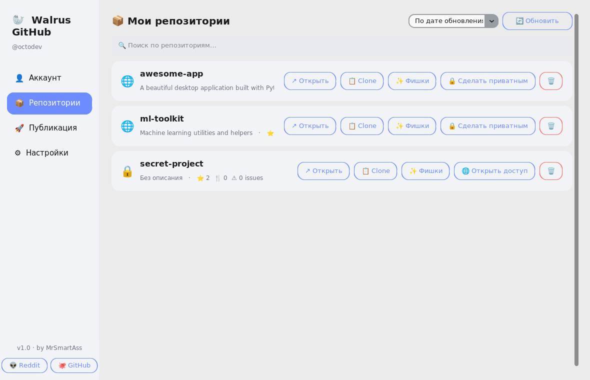
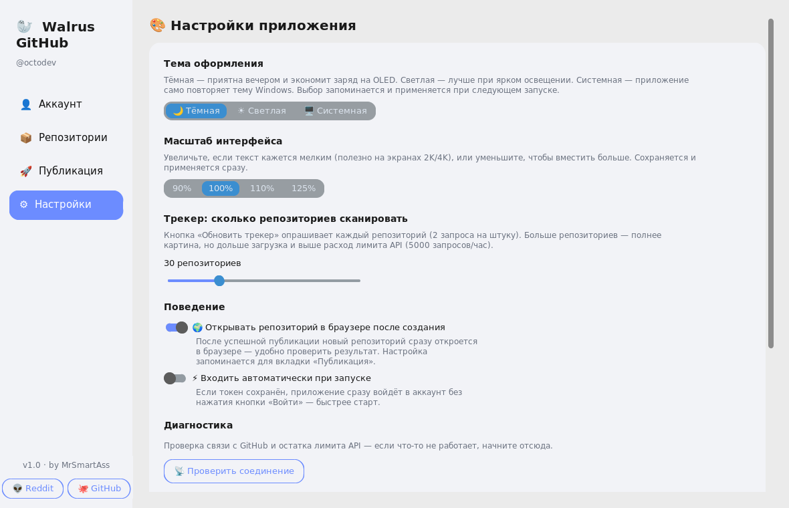

<p align="center">
  
</p>

<h1 align="center">Walrus GitHub</h1>

<p align="center">
  <b>Walrus GitHub Manager — a beautiful, minimalist desktop app to manage your GitHub account and repositories</b><br>
  Rounded corners everywhere · Dark & light themes · One-click repository publishing<br>
  <i>by <a href="https://github.com/mrsmartass700-blip">MrSmartAss</a></i> · <a href="https://github.com/mrsmartass700-blip">👽 Reddit</a> · <a href="https://github.com/mrsmartass700-blip">🐙 GitHub</a>
</p>

<p align="center">
  
  
  
  
  
</p>

---

## ✨ Screenshots

| Login | Account & Traffic tracker |
|---|---|
|  |  |

| Publishing (dark) | Repositories (light) | Settings (light) |
|---|---|---|
|  |  |  |

---

## 🚀 Download & Install

Ready-to-use builds are in [`release/`](release/):

### 🪟 Windows 10/11 (64-bit)
Download **`Walrus GitHub.exe`** and run it. Single file, no installation needed.

> SmartScreen may warn about an unknown publisher (the binary is unsigned).
> Click **More info → Run anyway**.

### 🐧 Linux (x64)
```bash
tar xzf WalrusGitHub-1.0-linux-x64.tar.gz
cd WalrusGitHub-1.0-linux-x64
./install.sh          # beautiful installer: app menu entry + icon
```
The app appears in your application menu as **Walrus GitHub**.
Run without installing: `./walrus-github` · Uninstall: `./uninstall.sh`

### 🍎 macOS
```bash
unzip WalrusGitHub-1.0-macos.zip
cd WalrusGitHub-1.0-macos
# double-click install.command in Finder
# (if blocked: right-click → Open → Open)
```
The installer creates a native **Walrus GitHub.app** in `~/Applications`
with a proper `.icns` icon. Requires Python 3.10+ from
[python.org](https://python.org). Uninstall: `uninstall.command`.

### 🐍 Run from source (any OS)
```bash
pip install -r requirements.txt
python app.py
```

---

## 🔑 First launch

1. Click **“Create a token on GitHub”** — a page opens with the right
   scopes pre-selected (`repo`, `user`, optional `delete_repo`).
2. Paste the `ghp_…` token: **Ctrl+V works on any keyboard layout**
   (including Russian), or right-click → Paste, or the 📋 button.
   The 👁 button shows/hides the token.
3. Optionally remember the token (stored locally in `~/.github_manager`)
   and enable auto-login in Settings.

---

## 🧰 Features

### 👤 Account
- Edit profile: name, bio, company, website, location, hireable flag
- **Traffic tracker** — views, unique visitors, clones and unique cloners
  for the last 14 days, totals + a per-repository table
  (fetched in **8 parallel threads** — fast)
- Total stars, forks, followers, API rate limits, notifications

### 📦 Repositories
- Search with debounce, sorting by update date / stars / name
- One-click **clone URL copy**, visibility toggle, safe delete
  (type-the-name confirmation)
- **“Goodies” dialog** — add community files & images to existing repos

### 🚀 Publishing
- Create a repository with **13 settings, each with a detailed
  explanation** right in the UI: private, issues, wiki, projects,
  discussions, auto-README, squash/merge/rebase, auto-delete branches,
  template repository, auto-merge, PR branch updates
- `.gitignore` template, license, topics, homepage, **custom default
  branch name**
- Auto-publish a local folder: via `git` if available, otherwise
  through the GitHub API — no git required

### ✨ 15 goodies — everything is pushed to GitHub **in English**
| Goodie | What it does |
|---|---|
| 🐞 Bug Report form | Structured issue form: steps, expected behavior, version, OS, checklist |
| 💜 Feedback form | Feature requests & feedback with a 1–5 star rating |
| 🏷 Label pack | 10 colored labels: bug, feedback, priority, good first issue… |
| 🤝 CONTRIBUTING.md | How to fork, branch, commit and open a PR |
| 📜 Code of Conduct | Community standards file |
| 🔀 PR template | Checklist for every pull request |
| 📄 README skeleton | Name, description, install, usage sections |
| 🎖 Badges | Live shields.io badges: stars, issues, license, last commit |
| 🛡 SECURITY.md | Private vulnerability reporting policy |
| 💰 FUNDING.yml | Sponsor button in the repo header |
| 📆 CHANGELOG.md | Keep-a-Changelog format |
| 🧹 .editorconfig | Consistent code style across editors |
| ⚙️ GitHub Actions CI | Compile check on every push / PR |
| 🔄 Dependabot | Weekly automated dependency update PRs |
| 👑 CODEOWNERS | You auto-review every PR |

### 🖼 Images
Pick screenshots/logo files — they are uploaded to `docs/images/` and
**automatically inserted into the README “Screenshots” section**.
An existing README is never overwritten: the section is appended.

### ⚙️ App settings (each explained, all persisted)
Theme (dark / light / system — both fully supported), UI scaling
90–125 %, tracker repo limit, auto-open browser, auto-login,
connection diagnostics.

---

## ⚡ Stability & speed

- Single HTTP session with keep-alive + **automatic retries** (3×) on
  network failures
- Parallel traffic fetching, debounced search, repository cache
- Thread-safe UI queue — background work never freezes the interface
- Request timeouts on everything

## ✅ Tested — 52/52 automated tests

Every API method and every UI button is covered: login, profile,
repository CRUD, topics, traffic, files (create + overwrite), labels,
branch rename, README append, all 15 goodies, image upload (new and
existing README), local folder publishing (git and API fallback),
themes, scaling, config persistence, clipboard on Russian layout —
plus a check that **no Cyrillic ever reaches GitHub**.

```bash
cd tests
python test_api.py    # 26 tests — API client against a mock GitHub server
python test_app.py    # 26 tests — UI & logic (needs a display / Xvfb)
```

## 🏗 Project structure

```
github-manager/
├── app.py               # UI (CustomTkinter, RU interface)
├── api.py               # GitHub REST API client (EN output)
├── templates_en.py      # English templates pushed to GitHub
├── requirements.txt
├── BUILD_EXE.bat        # one-click Windows build (PyInstaller)
├── assets/              # black & white walrus icon (ico + png)
├── docs/screenshots/    # README screenshots
├── release/             # ready builds: Windows / Linux / macOS
└── tests/               # 52 automated tests + mock GitHub server
```

## 🌍 Language policy

The interface is in Russian, but **everything the app sends to GitHub —
issue templates, README, labels, commit messages, community files — is
strictly in English**, so your repositories stay friendly to the global
community.

---

## 🇷🇺 Кратко по-русски

**Walrus GitHub Manager** (by MrSmartAss) — красивое минималистичное
приложение для управления GitHub: профиль, трекер посещений и скачиваний,
создание репозиториев со всеми настройками (у каждой — подробное
объяснение), 15 «фишек» для баг-репортов и отзывов, загрузка картинок
с автодобавлением в README.

- **Windows**: запустите `release/Walrus GitHub.exe`
- **Linux**: распакуйте `WalrusGitHub-1.0-linux-x64.tar.gz` → `./install.sh`
- **macOS**: распакуйте `WalrusGitHub-1.0-macos.zip` → `install.command`

Всё, что уходит на GitHub, — только на английском. Интерфейс — на русском.

<p align="center">🦭 Walrus GitHub Manager · by <a href="https://github.com/mrsmartass700-blip">MrSmartAss</a></p>
